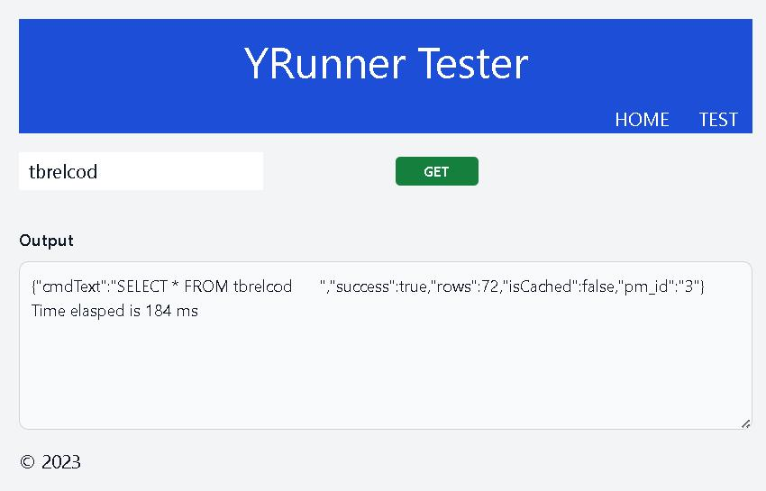
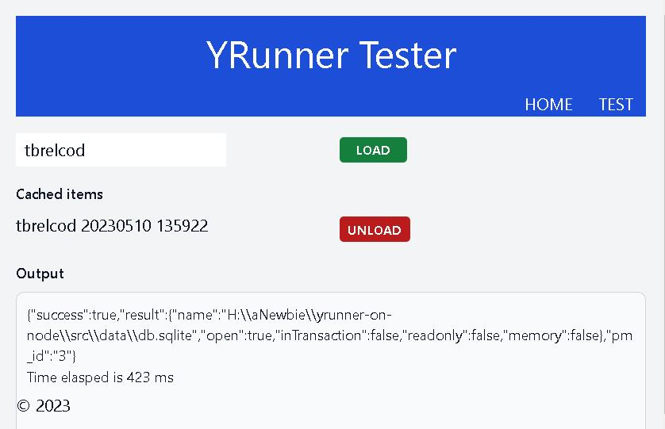
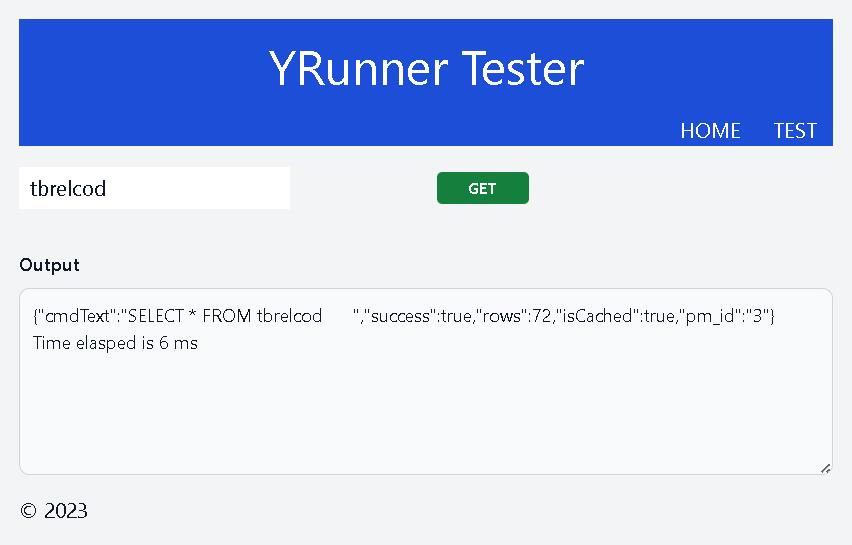

## The sequel to YON --- Caching code tables


<div style="text-align: center; color:white; background-color:black"><em>
Impia tortorum longos hic turba furores<br />
Sanguinis innocui, non satiata, aluit.<br />
Sospite nunc patria, fracto nunc funeris antro,<br />
Mors ubi dira fuit vita salusque patent.<br />
<br />
[Quatrain composed for the gates of a market to be erected upon the site of the Jacobin Club House at Paris.]
</em></div>


### Prologue
In the realm of database, data are treated in different ways. Data, per se, can be divided into [transactional](https://www.tibco.com/reference-center/what-is-transactional-data) and non-transactional. Code tables, such as employee names, product categories, site/location addresses, are typical non-transactional and be always referenced by transactional data. Since they are infrequently changed, caching code tables lest round-tripping to backend database again and again for the same set of data can be a performance boost especially for tight budget system. 


### I. Load/Unload cache
1. Show cache status 
```
POST http://localhost:8989/api/v2/cache/status
```

2. Load table into cache
```
POST http://localhost:8989/api/v2/cache/load/tbrelcod
```

3. Unload table from cache 
```
POST http://localhost:8989/api/v2/cache/unload/tbrelcod
```


### II. Using cached data
1. Get all
```
GET http://localhost:8989/api/v2/yr/tbrelcod
```

2. Get all with options
```
GET http://localhost:8989/api/v2/yr/tbrelcod?_filter=relcod>='20'&_sort=relcod&_order=asc&_offset=5&_limit=10&_lowerKeys=true
```

3. Get one 
```
GET http://localhost:8989/api/v2/yr/tbrelcod/99?_keyname=relcod&_keytype=string&_lowerKeys=true
```

### III. SQLite-server 
check [here](https://github.com/Albert0i/sqlite-server.git)

### IV. Summary 
A year ago, an experimental version of YRunner was designed and implemented in an effort to [Caching SQL results with Redis](https://github.com/Albert0i/misdoc/blob/main/CSRWR.md). As performance continues to be an issue and so does the cache. If there is no difference in reading remote and local database, why bother to stack up one more layer to the code? 








### V. Reference
1. [SQLite](https://www.sqlite.org/index.html)
2. [better-sqlite3](https://www.npmjs.com/package/better-sqlite3)
3. [SQLite Extraction of Oracle Tables Tools, Methods and Pitfalls](https://www.linuxjournal.com/content/sqlite-extraction-oracle-tables-tools-methods-and-pitfalls)
4. [The Pit and the Pendulum](https://poemuseum.org/the-pit-and-the-pendulum/)


### Epilogue 
```
這裡邪惡的折磨者長期憤怒，
他被無害的血液滋養，並不滿足。
國今待，葬窟今破，
死亡，生命是可怕的，而健康是開放的。

[為在巴黎雅各賓會所舊址上建造的市場大門而作的四行詩。]
```


### EOF (2023/05/10)
