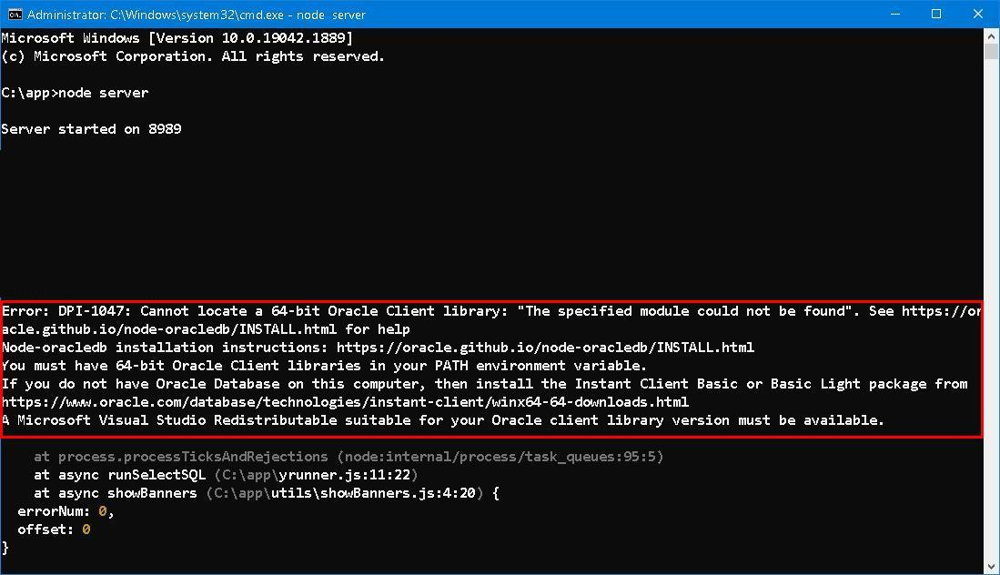
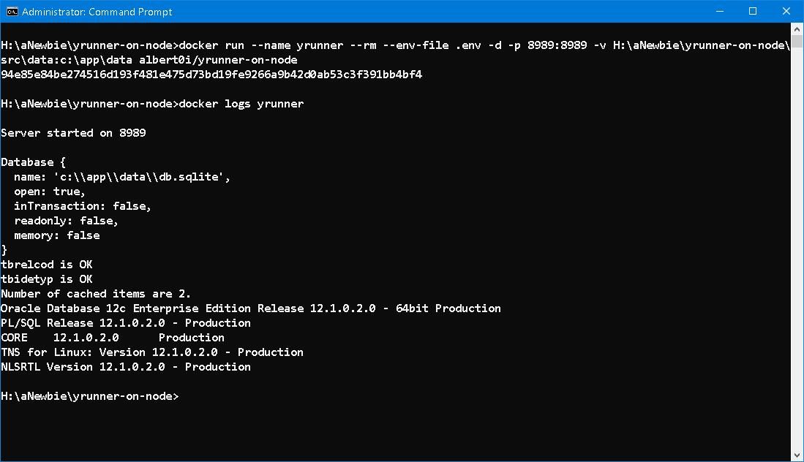
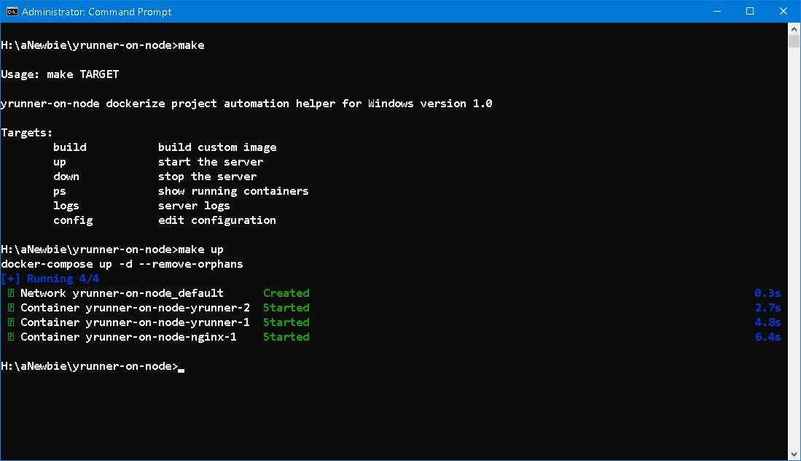
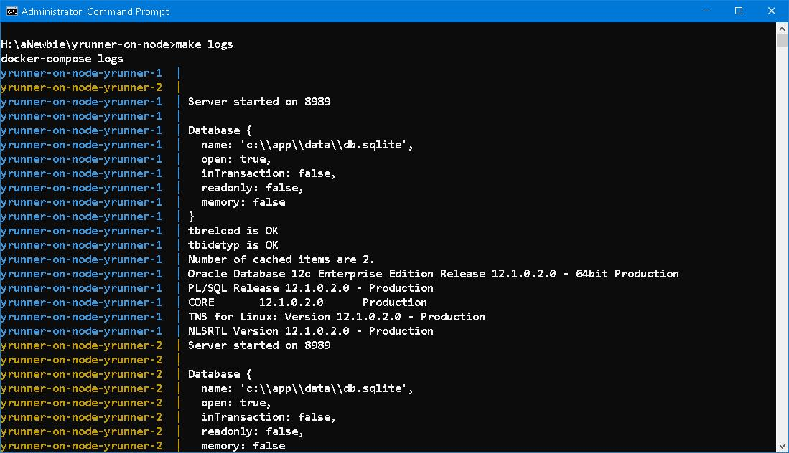

## Another sequel to YON --- Dockerization


### Prologue
It was the very last day of May. The impending rainstorm enshrouded the whole city in high temperature, burning air inflicted much pain and itch on skin. Being quickly dehydrated but not even a small bead of sweat appeared on my forehead, I was weary and haggard yet rambling along the street. Heavy and rapid respirations were made and heard lest suffocation and drop dead instantly... 

Previously, we've deployed `yrunner-on-node` using [PM2](https://pm2.keymetrics.io/) and this is the most easy and handy way, I think. This time, we are going to use [Docker](https://www.docker.com/), a far more difficult way.


### I. Dockerfile
There exists pre-built [oraclelinux](https://hub.docker.com/_/oraclelinux) image serves this purpose. Windows containers are obfuscating and, in a way, obscure and opaque when comparing to Linux containers. We have to build every from scratch. Based on `nanoserver:20H2` or `servercore:20H2`, we need to install: 

1. NodeJS, Version 18.16.0
2. NPM packages 
3. Microsoft Visual Studio 2017 Redistributable
4. Oracle Instant Client for Microsoft Windows (x64) 64-bit



As far as I can test, Oracle libraries can be loaded on `nanoserver:20H2`, it seems that the driver has *32-bits dependencies* which had been trimmed in order to reduce the size. Our last resort is falling back to `servercore:20H2`, which bloated the image size to more than 6 GB with a *successfully* ending!!!



The final version of our manuscript is like this: 

```
FROM mcr.microsoft.com/windows/servercore:20H2

WORKDIR /app
COPY package.json .

ENV PATH="C:\Windows\system32;C:\Windows;C:\app\node-v18.16.0-win-x64;C:\app\instantclient_19_19;"
 
RUN curl.exe -o node-v18.16.0-win-x64.zip -L https://nodejs.org/dist/v18.16.0/node-v18.16.0-win-x64.zip && \
    tar.exe -xf node-v18.16.0-win-x64.zip && \
    del node-v18.16.0-win-x64.zip && \
    npm install --omit=dev && \
    curl -fSLo vc_redist.x64.exe https://aka.ms/vs/17/release/vc_redist.x64.exe && \
    start /w vc_redist.x64.exe /install /quiet /norestart && \
    del vc_redist.x64.exe && \
    curl.exe -o instantclient-basic-windows.x64-19.19.0.0.0dbru.zip https://download.oracle.com/otn_software/nt/instantclient/1919000/instantclient-basic-windows.x64-19.19.0.0.0dbru.zip &&\
    tar.exe -xf instantclient-basic-windows.x64-19.19.0.0.0dbru.zip && \
    del instantclient-basic-windows.x64-19.19.0.0.0dbru.zip 

COPY src .

EXPOSE 8989
CMD [ "node.exe", "c:\\app\\server"]
```


### II. docker-compose.yml
To leverage our docker image, we need a `docker-compose` and `Makefile` file, so as to bring up the entire *ecology circle*. 

```
version: "3"
services:

  nginx:
    image: 
      ${NGINX_IMAGE_NAME}:${NGINX_IMAGE_VERSION}
    ports:
      - "8989:8989"
    volumes:
      - ${NGINX_CONF_DIR}:C:\nginx\conf
    depends_on:
      - yrunner

  yrunner:
    build: 
      context: .
    image: 
      ${IMAGE_NAME}:${IMAGE_VERSION}
    volumes:
      - ${DATA_DIR}:C:\app\data
      - ${LOG_DIR}:C:\app\logs
    deploy:
      replicas: 2
    env_file: .env
```

As you can see, we run [Nginx](https://www.nginx.com/) as reverse proxy and two copies of `yrunner` as backend server. 




### III. Docker in action 
All setting are done in one *.env* file.

```
# image name 
NGINX_IMAGE_NAME=nginx
# image version 
NGINX_IMAGE_VERSION=1.24.0-servercore-20H2
# config direcgory
NGINX_CONF_DIR=C:\Docker\yrunner-on-node\nginx.conf

# image name
IMAGE_NAME=albert0i/yrunner-on-node
# image version
IMAGE_VERSION=1.0

# data directory
DATA_DIR=C:\Docker\yrunner-on-node\src\data
# logs direcgory
LOG_DIR=C:\Docker\yrunner-on-node\src\logs
```




### IV. Summary 
NodeJS is best known for it's small, fast and swift. Whereas the code size, which includes libraries and packages, is 226KB, the built image size for Windows container is 6.11G! 

Whether it's worthwhile or worthless to build and deploy in this way, I don't know. It's completely up to you... at your disposal... 


### V. Reference
1. [Oracle Instant Client Downloads for Microsoft Windows (x64) 64-bit](https://www.oracle.com/database/technologies/instant-client/winx64-64-downloads.html)
2. [Microsoft Visual C++ Redistributable latest supported downloads](https://learn.microsoft.com/en-us/cpp/windows/latest-supported-vc-redist?view=msvc-170)
3. [How to install Visual C++ 2015 Redistributable to this image?](https://github.com/microsoft/dotnet-framework-docker/issues/15)
4. [Running a Node / Angular Application in a container based on Windows Nano Server](https://kevinsaye.wordpress.com/2019/08/06/running-a-node-angular-application-in-a-container-based-on-windows-nano-server/)
5. [Dockerfiles for node-oracledb are Easy and Simple](https://blogs.oracle.com/opal/post/dockerfiles-for-node-oracledb-are-easy-and-simple)
6. [The Angel of the Odd](https://poemuseum.org/the-angel-of-the-odd/)


### Epilogue 
```
```


### EOF (2023/05/31)
